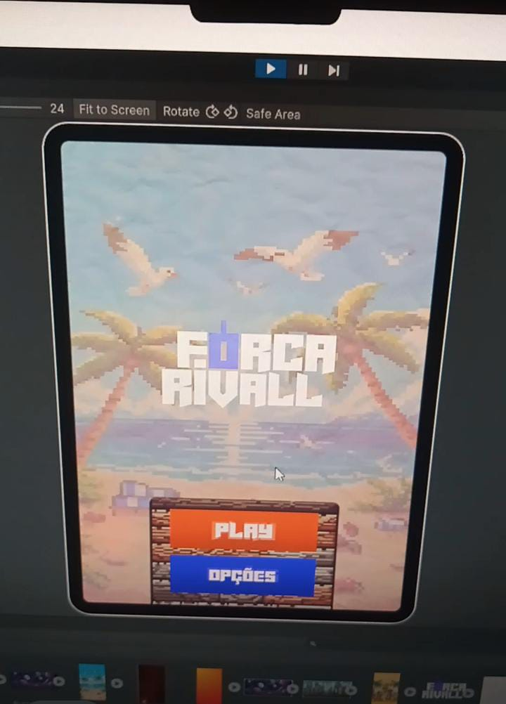
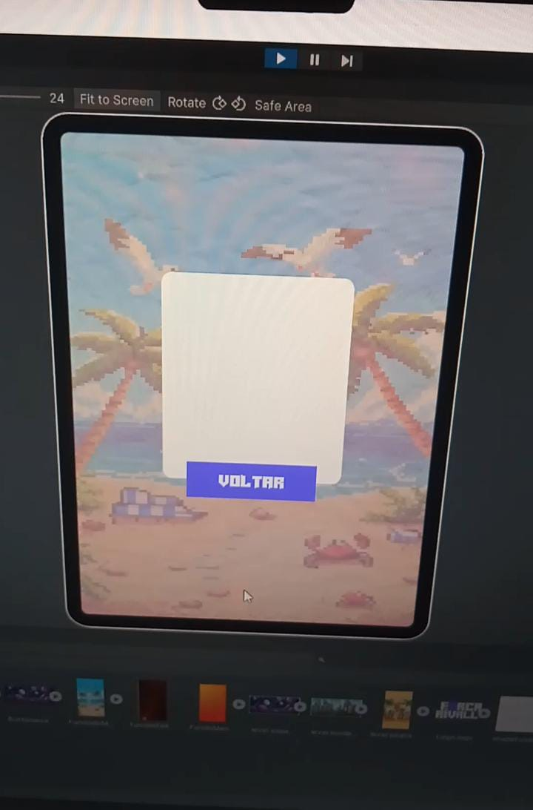

# 🪓 Jogo da Forca Competitivo 🆚

Um jogo da forca onde você enfrenta um rival, seja um amigo ou a IA. Um jogador escolhe uma palavra e o outro deve adivinhar antes que o "homem da forca" seja completado. Divirta-se em partidas solo ou multijogador!

## 🚀 Funcionalidades

- **Modo Solo:** Enfrente a inteligência artificial (IA).
- **Modo Multijogador:** Desafie um amigo localmente ou online.
- **Palavras Personalizadas:** Escolha suas próprias palavras para desafiar o rival.
- **Sistema de Pontuação:** Acompanhe o desempenho ao longo de várias rodadas.
- **Interface Intuitiva:** Visual simples com um desenho animado da forca que é completado a cada erro.

## 📷 Demonstrações

### 1. Tela de Jogo

### 2. Tela de Opções

